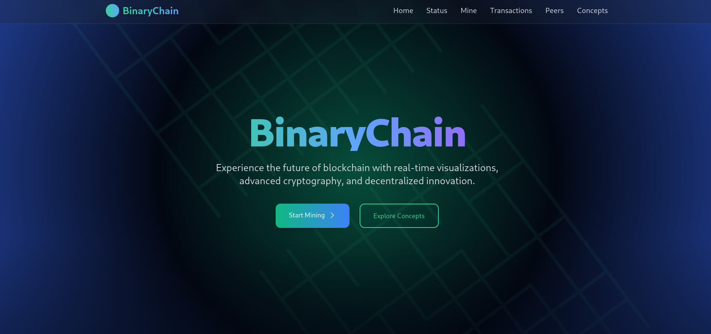

<h2>BinaryChain: An Interactive Blockchain Learning Platform</h2> 
Welcome to <strong>BinaryChain</strong>, a cutting-edge educational platform designed to demystify blockchain technology through interactive learning experiences. Built with modern tools like Next.js, TypeScript, Tailwind CSS, Framer Motion, and Prisma, BinaryChain offers a comprehensive and engaging way to explore the fundamentals of blockchain.

<h3>Overview</h3> 
BinaryChain is more than just a learning platform—it's an immersive environment where users can interact with blockchain concepts firsthand. Whether you're a student, developer, or simply curious about blockchain, BinaryChain provides the tools and resources to deepen your understanding of this transformative technology.

  

<h3>Key Features</h3> <ul> <li><strong>Interactive Learning Modules</strong>: Dive into core blockchain concepts such as cryptographic security, peer-to-peer networks, smart contracts, distributed ledgers, consensus algorithms, and immutable records. Each module is paired with quizzes and FAQs to reinforce learning.</li> <li><strong>Blockchain Visualization</strong>: Get a real-time view of blockchain data, transactions, and mining statistics through dynamic and interactive components. Visualize how blocks are created, transactions are verified, and the network operates.</li> <li><strong>API Endpoints</strong>: Manage and interact with blockchain data, including blocks, transactions, and peers, using RESTful APIs. Perfect for developers who want to build custom applications or integrate blockchain functionality.</li> <li><strong>Responsive Design</strong>: Enjoy a seamless experience on both desktop and mobile devices. The platform features a futuristic cyberpunk-themed UI with neon gradients and glassmorphism effects, creating an engaging and modern user experience.</li> <li><strong>Robust Database Management</strong>: Powered by Prisma ORM, BinaryChain supports SQLite and PostgreSQL databases to securely store and manage blockchain data.</li> </ul>
<h3>Technical Stack</h3> 
BinaryChain is built using industry-leading technologies to ensure scalability, performance, and security:
 <ul> <li>Frontend: Next.js and TypeScript for a robust and type-safe client-side experience</li> <li>UI/UX: Tailwind CSS and Framer Motion for a responsive and visually appealing design</li> <li>Database: Prisma ORM with SQLite/PostgreSQL for efficient data management</li> </ul>
<h3>Why Choose BinaryChain?</h3> 
BinaryChain stands out as a unique platform that combines education with hands-on experimentation. It’s designed for:
 <ul> <li>👨💻 <strong>Developers</strong>: To experiment with blockchain APIs and build custom applications</li> <li>📚 <strong>Students</strong>: To gain a deeper understanding of blockchain fundamentals</li> <li>🛠️ <strong>Curious Learners</strong>: To explore blockchain through interactive visualizations and quizzes</li> </ul>
<h3>Get Started Today</h3> 
Join the BinaryChain community and embark on your blockchain learning journey. Whether you're exploring blockchain for the first time or looking to expand your knowledge, BinaryChain provides the tools and resources to help you succeed.

Ready to dive in? Explore interactive modules, visualize blockchain data, and start building your blockchain skills with BinaryChain.
